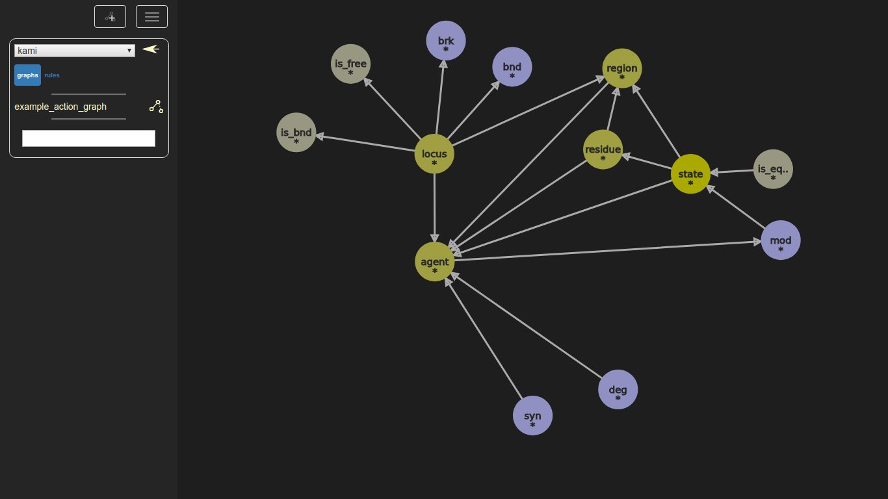
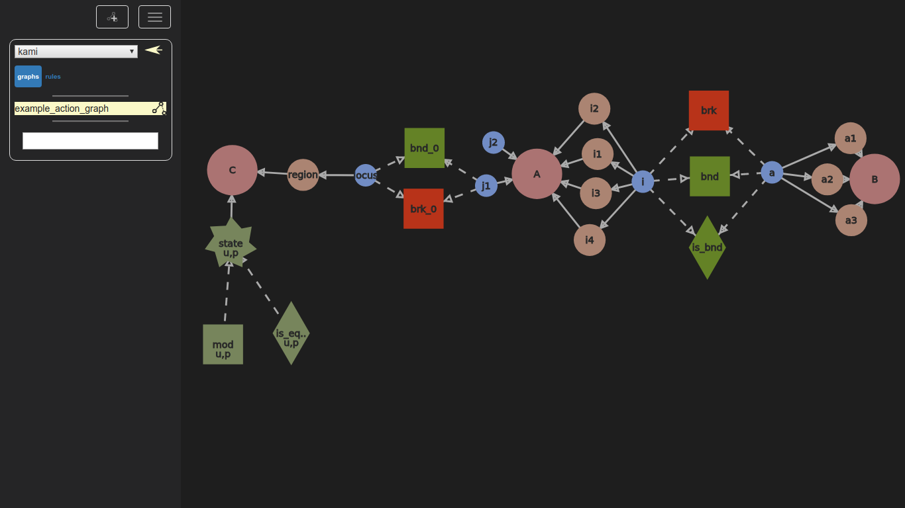
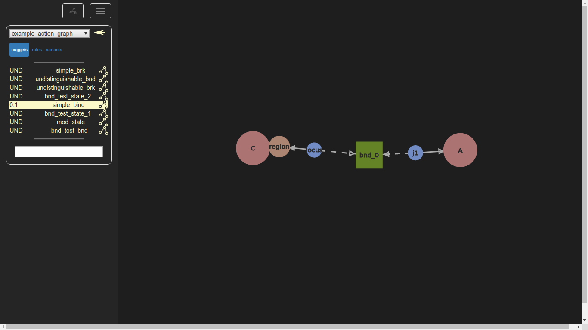
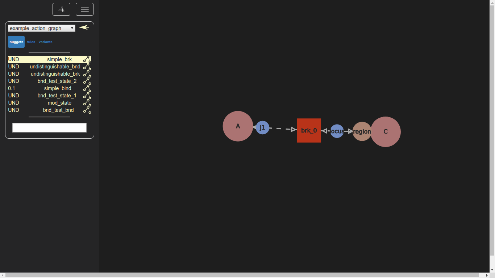
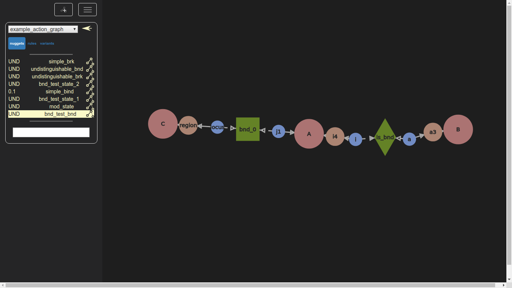
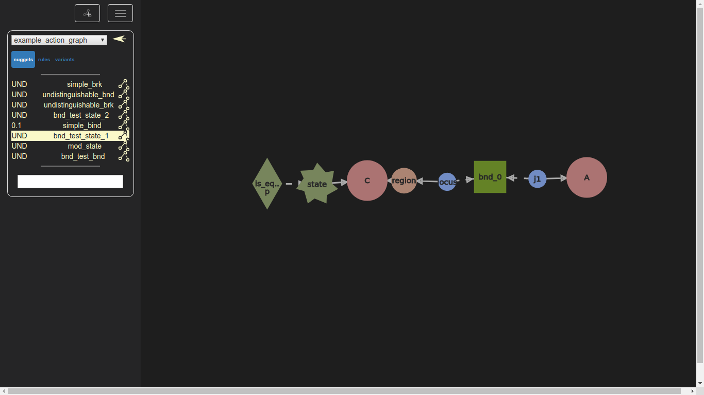
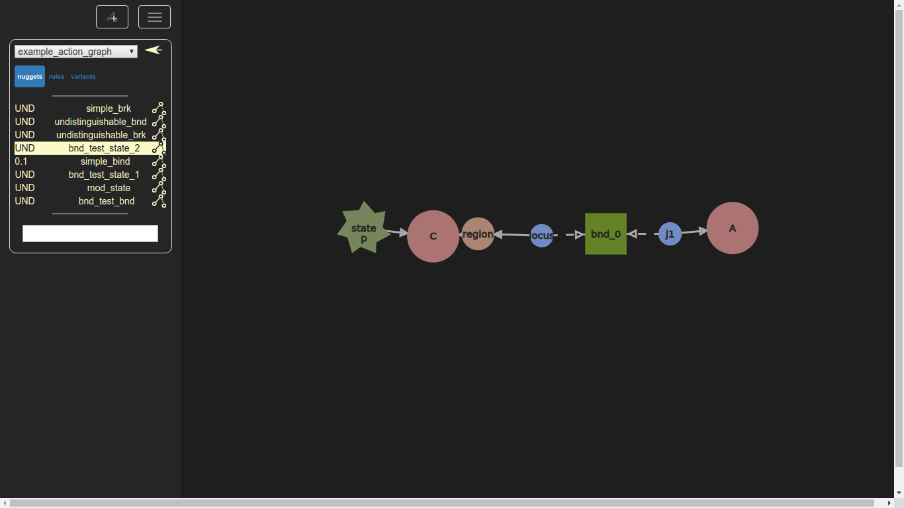
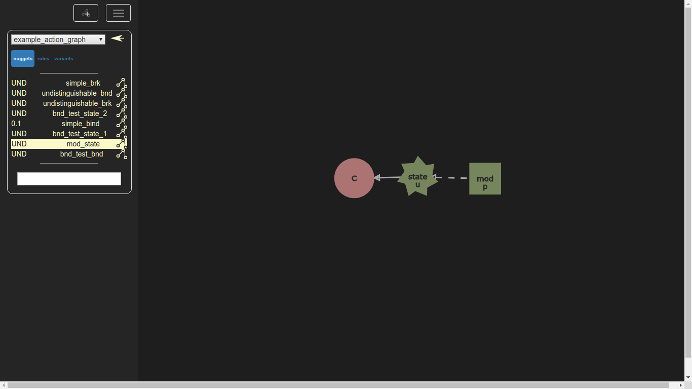
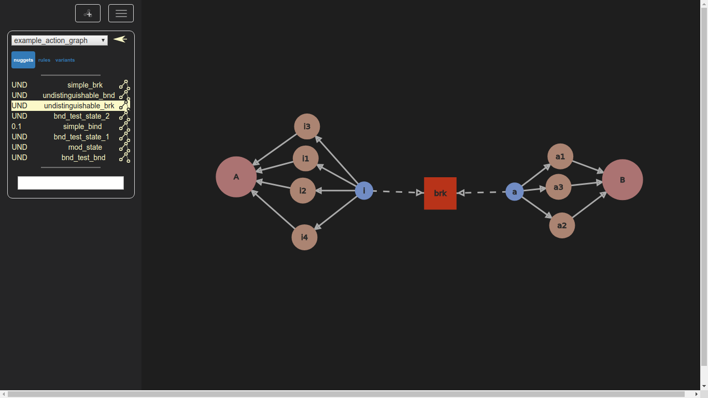

Brief introduction to kami for the kappa user.

# Installation
 1. Create a virtual environment named venv

    ```
    virtualenv venv -p path/to/your/python3
    ```

 1.  Activate it

     ```
     source venv/bin/activate
     ```
1. Install the ReGraph library.

    ```
    git clone https://github.com/Kappa-Dev/ReGraph.git
    cd ReGraph
    pip install -r requirements.txt
    pip install -e .
    ```
1. get and install kami

    ```
    cd ..
    git clone https://github.com/Kappa-Dev/KAMI.git
    cd KAMI
    pip install lxml
    pip install -e .
    ```
# Launching KAMI
```
 python3 kami/server/webserver.py
```
Then connect to the server at address http://localhost:5000 using a web browser. We use chrome for this as KAMI appears to run best on it (which results in a lack of testing for other browsers). 


# Examples

First import the examples.json file using the hamberger menu 

## The hierarchy
On the left side is the graph hierarchy browser that should contain a graph named **kami_base**.
Clicking on it once displays the **kami_base** graph.
Double clicking on it, is similar to entering a folder, that contains other graphs *typed* by the **kami_base graph** (in this case a graph called **kami**).

>A *typing* of a graph assigns to each of its nodes a node from another graph (this other node is called its *type*). This mapping must preserve edges and nodes attributes.

Clicking on the **kami** graph displays it.

The nodes of this graph will be the types of the nodes of our models. For instance, nodes of type **agent** will end up being kappa agents. 

Double clicking on kami, we discover the *action graph* called **example_action_graph**. As before, clicking on it displays it.
The action graph is an overview of the model. For now we can think of it as a way to:
* visualize, explore the model and organize the rules. 
* defines the various components and put constrains the actual (kappa like) rules we can express. This is because these rules are themselves represented as graphs that are typed by the action graph.


We can see some example rules by double clicking on the **example_action_graph** name. 

## The example rules
We call these rules *nuggets* in kami.
Some of them may actually result in multiple kappa rules. We can generate kappa code by left-clicking on any rule, then selecting the rules we want to use, then clicking the "Get kappa button".

### simple_bind

In this example, **A** and **C** will be kappa agents.
The locus **j1** will become a kappa site of **A**.
The pair composed of the region **region** and the locus **locus** will be a kappa site of **C** named **region_locus** (the binding site called **locus** that is situated on region **region**).

This nugget represents the binding rule of site **j1** of agent **A** to site **region_locus** of agent **C**.

### simple_brk

This is the opposite rule of **simple_bind** specifying the the agents can break appart.

### bnd_test_bnd

This nugget adds a test (a trigle node) to the binding rule. Site **i4_i** of Agent **A** must be bound to site **a3_a** of Agent **B** for this binding rule between **A** and **C** to happen.

### bnd_test_state_1

This nugget tests the value of state **state**. It must be **p** of the binding rule cannot apply.
> Unlike in kappa, states sites are disjoints from binding sites in kami. 

### bnd_test_state_2

This nugget has the same meaning as the previous one. We can implicitly put the value of the test on the state instead of using a explicit test nodes (but tests nodes are still usefull in other cases).

### mod_state

This nuggets modifies the value of state **state** of agent **C**, from **u** to **p**

### undistinguishable_bnd

This nugget represents twelve different kappa rules. From any of the sites **a1_a, a2_a or a3_a** of agent **B** to any of the sites **i1_i, i2_i, i3_i, i4_i** of agent A.

### undistinguishable_brk

 This nugget generates the twelve unbinding rules that reverse the bindings ones from undistinguishable_bnd.

## Working with the action graph
Some examples of how to take advantage of the structure provided by the action graph.
### Exploring the model
#### Middle click
Middle clicking on a node of the action graph has two effects:
* It filters the list of nuggets, and only displays the ones that contain a node typed by the clicked node.
* It hides the nodes of the action graph that are not used in these nuggets, and are not directly related to the clicked node.
 
For example, middle clicking a node of type **is_bnd** will only keep the nuggets that test this particular binding, and may become enabled by it.

### Modifying the action graph
Modifying the action graph can help making large scale transformations of the model, and are done at a more abstract level than directly modyfing the rules.
#### Introducing conflict
 Merging two loci of the action graph that are situated on the same region, or directly on the same agent, will identify them. All the rules that used one or the other will then use this new unique locus, which will result in more conflicts.
#### Removing conflict
The opposite can be done by left clicking a locus. One new locus is created in the action graph for each possible binding, which has the effect of removing the conflicts between the rules.
#### Splice variants
It is possible to define new variants of agents (for example one that lost a region), and to automatically generate all the rules that still hold for them (if a binding site is removed, all the rules involving it, are not valid anymore and will be discarded).

### Merging action graphs
The action graph contains the declaration of all the components used in the nuggets.
Given two different models (two action graphs and their respective nuggets), we can compoe them by identifying some nodes of the two action graph, and creating a new bigger action graph that will type all the existing nuggets.

## DataBases integration
TODO